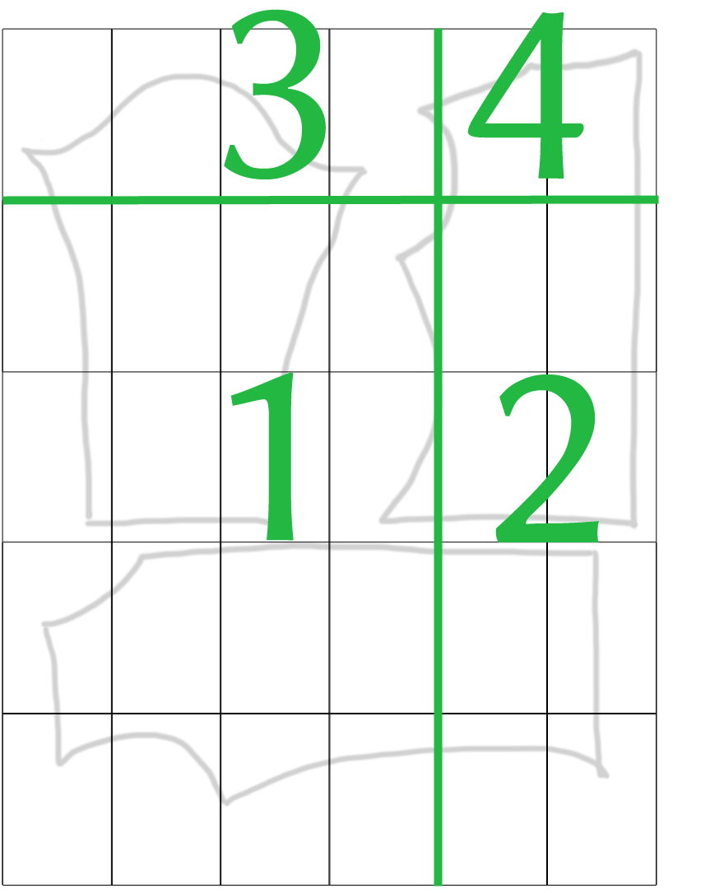

# Nobubo
Digital sewing patterns are very handy: No shipping costs and cheaper than physical patterns. There is one drawback: Many digital patterns are distributed in A4 size, and it is up to the sewist to assemble them.

A jacket pattern has around 50 A4 pages that must be glued or taped together. This usually results in an apartment covered in A4 pages and a final collage in which printer irregularities lead to ill-matching pattern lines. Many indie pattern companies already sell their digital patterns as A4 and A0 in the same pattern purchase, but there are still other companies that only provide A4.

That's why I wrote nobubo: This tool assembles the pages of a digital pdf pattern and chops it into a desired output size, so that you can print it on any page size you want. 

Nobubo has been developed and tested with several download patterns from Burda, Knipmode and other brands successfully.

## Prerequisites
* A digital pattern where each page is made to be printed on A4 or US letter size. **If you haven't purchased a digital pattern, Nobubo is useless**.
* Each page is already cropped, so that only the bare pattern is visible (no white borders around the pattern). Nobubo is able to handle cropped pdfs, but you still have to do it yourself.
* At least one overview sheet that shows what the assembled pattern should look like in the end. Usually, the assembled pattern pages form a huge rectangle. Some vendors disregard this and the assembled pattern is of a weird "rectangle + 2 pages" shape. Nobubo can only handle rectangle shapes, so you still have to print and assemble those leftover pages by hand.
* Python >=3.7, `click, PyPDF2`
* `pdflatex` [must be installed](https://tex.stackexchange.com/questions/49569/where-to-download-pdflatex-exe)

## Usage
```bash
$ python -m nobubo --il OVERVIEW COLUMNS ROWS --ol {a0|mmxmm} {--reverse} INPUTPATH OUTPUTPATH
```

Have a look at the mock patterns in the test folder. Use them with with the above commands and see how it works.

### Example with one overview sheet, reverse assembly, A0 output

This example pattern has 5 rows and 6 columns on one overview sheet on page 1 (see also picture below):

```bash
$ python -m nobubo --il 1 6 5 --ol a0 --reverse "home/alice/patterns/jacket.pdf" "home/alice/patterns/jacket_a0.pdf"
```
*  `--il ` (input layout) is required and followed by three numbers:
  * `1`: the page on which the overview sheet is located. `0` if there is no overview.
  * `6 5`: columns and rows you count on the overview sheet.
* `--ol` (output layout) defines the size on which the pattern shall be printed. Currently supported:
  * `a0`: Output size is A0.
  * `mmxmm`: use a custom output size in millimeters, e.g. `920x1187`.
* if `--ol` is omitted, Nobubo just prints a huge collage of all assembled pages without chopping them up into an output layout.
* `--reverse`: as default, the pattern is assembled from top left to bottom right. Use the `--reverse` flag to assemble it from bottom left to top right, which is needed for Burda patterns for example.
* `"home/alice/patterns/jacket.pdf"`: the path to the original pattern including filename.
* `"home/alice/patterns/jacket_a0.pdf"`: the path where the collage should be saved, including filename.

The pdf has 6 columns and 5 rows, which means the final pdf collage will comprise four A0 pages to print, since 16 A4 pages fit on one A0 page. This is how the sample overview sheet might look like and how it will be split up:



Of course, you can still choose to print pages 2-4 on A4 from your original pattern and just page 1 on A0.

**The order of assembly differs between pattern companies. Burda assembles the pages from bottom left to top right, whereas others (Knipmode) assemble them from top left to bottom right. Please compare the order of the pdf pages in the pdf itself to the overview to see in which way the pages are assembled.**

### Example with two overview sheets

```bash
$ python -m nobubo --il 1 8 4 -il 34 7 3 --ol a0 "home/alice/mypattern.pdf"  "home/alice/results/mypattern_a0.pdf"
```

The first overview sheet is on page 1 with 4 rows, 8 columns: `--il 1 8 4`.  The second overview sheet is on page 34 with 3 rows, 7 columns: `--il 34 7 3`. The assembly is from top left to bottom right, the output on A0.

### Example with just a collage

``` bash
$ python -m nobubo --il 1 8 4 --il 34 7 3 "home/alice/mypattern.pdf"  "home/alice/results/mypattern_a0.pdf"
```

This prints only two pdfs (=2 overview sheets) which contain each a huge collage.

### Example with no overview sheet

Some pattern companies provide the overview sheet separately, for example in the pdf together with the sewing instructions. Then, the pattern pdf really and only contains the A4 pages of the pattern. In this case, write `0` for the overview sheet:

```bash
$ python -m nobubo --il 0 6 5 --ol a0 "home/alice/patterns/jacket.pdf" "home/alice/patterns/jacket_a0.pdf"
```

## Caveats
* Please double-check and compare the overview sheet with the amount of pdf pages given (rows * columns = amount of pages needed).  If the result is wrong, check if you counted the rows and columns correctly or if a second overview sheet hides in later pages.
* Check if the pattern must be assembled from top left to bottom right (default) or bottom left to top right (use `--reverse` flag)
* When you print the final pattern pages,  double-check and measure the control square. Don't forget to print 100% "as is", with any scaling or page fitting off.

**I do not take any responsibility if nobubo leads to ill-matching garments or any other problems whatsoever. You use this tool at your own risk. If in doubt, make a backup of your original pattern pdf. Please have a look at the license if you want to improve the tool yourself.**
